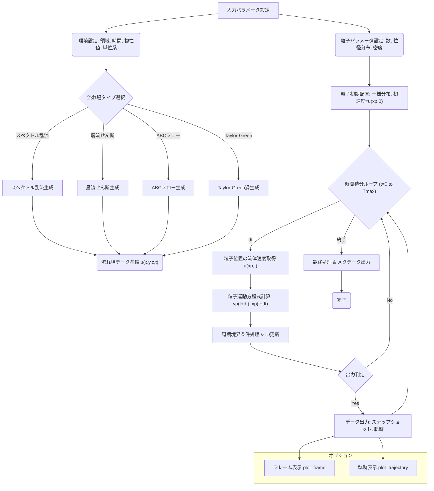

## 3次元球形粒子運動シミュレーションコード 要件定義書 (v1.1 Final)

**改訂履歴:**
*   **v1.1 Final (2023/MM/DD):** ユーザー最終確認に基づき確定。JSON構造、UUID使用を反映。
*   v1.1 (2023/MM/DD): v1.0 に対するユーザーフィードバックを反映。データ出力形式をJSONに統一、可視化ライブラリ要件を変更、慣性指定方法を明確化。
*   v1.0 (2023/MM/DD): 初版作成。二つのAI提案を統合・改善。

**1. 目的 (Scope)**

本プロジェクトの目的は、インラインホログラフィを用いた3次元粒子追跡速度計測法 (3D-PTV) のベンチマークデータ生成のためのシミュレーションコードをJulia言語で開発することである。特に混相乱流における分散相の挙動解明を念頭に置き、**指定された有限体積内で、特性の異なる複数の非圧縮流れ場により輸送される球形粒子群**の時系列データ（粒子座標）を厳密に計算する。

本コードの出力は、ホログラム生成アルゴリズムへの入力、および3D-PTVアルゴリズムの精度検証・比較評価のための厳密なベンチマークとして利用されることを想定する。

**2. 定義と記号**

| 記号                                 | 意味                                                               | 単位例 (物理単位系の場合) |
| :--------------------------------- | :--------------------------------------------------------------- | :------------- |
| $\mathbf{x}=(x,y,z)$               | 実空間座標ベクトル ($y$軸: 鉛直上向き, $x,z$軸: 水平)                              | m              |
| $t$                                | 時間                                                               | s              |
| $L_x, L_y, L_z$                    | 計算領域の各辺長                                                         | m              |
| $N_x, N_y, N_z$                    | 流れ場定義用グリッドの各方向の格子点数                                              | -              |
| $\Delta x, \Delta y, \Delta z$     | グリッド間隔 ($L_x/N_x$ 等)                                             | m              |
| $\mathbf{k}=(k_x,k_y,k_z)$         | 波数ベクトル ($k_x = 2\pi n_x / L_x$ 等)                                | 1/m            |
| $k =\mathbf{k}$                    | 波数                                                               | 1/m            |
| $\mathbf{u}(\mathbf{x},t)$         | オイラー流体速度ベクトル                                                     | m/s            |
| $\tilde{\mathbf{u}}(\mathbf{k},t)$ | 流体速度のフーリエ係数ベクトル                                                  | (m/s) * m^3    |
| $\mathbf{x}_p(t)$                  | 時刻 $t$ における粒子 $p$ の位置ベクトル                                        | m              |
| $\mathbf{v}_p(t)$                  | 時刻 $t$ における粒子 $p$ の速度ベクトル                                        | m/s            |
| $d_p$                              | 粒子 $p$ の直径                                                       | m              |
| $\rho_p$                           | 粒子密度                                                             | kg/m^3         |
| $\rho_f$                           | 流体密度                                                             | kg/m^3         |
| $\mu_f$                            | 流体粘性係数                                                           | Pa·s           |
| $\nu_f = \mu_f / \rho_f$           | 流体動粘性係数                                                          | m^2/s          |
| $\mathbf{g}=(0,-g,0)$              | 重力加速度ベクトル ($g \ge 0$)                                            | m/s^2          |
| $\tau_p$                           | 粒子の速度応答時間 (Stokes則)                                              | s              |
| $St = \tau_p / \tau_f$             | Stokes数 (粒子応答時間 / 流体の特徴的時間スケール)                                  | -              |
| $N_p$                              | 全粒子数                                                             | -              |
| $ID_p$                             | 粒子軌跡の識別子 (**UUID**)                                              | -              |
| $E(k)$                             | 3次元エネルギースペクトル密度関数 ($ \int_0^\infty E(k) dk = \frac{3}{2} u'^2 $) | m^3/s^2        |
| $u'_{rms}$                         | 乱流速度のRoot Mean Square (RMS) 値                                    | m/s            |

**注記:**
*   コード内部および入出力において、物理単位系を基本とするが、無次元化されたパラメータ（Stokes数など）も扱えるようにする (FR-ENV-04, FR-DYN-02)。

**3. 前提条件 (Assumptions)**

1.  **非圧縮性:** 流体は非圧縮 ($\nabla \cdot \mathbf{u} = 0$) とする。
2.  **希薄分散相:** 粒子濃度は十分に低く、粒子間相互作用（衝突、流体力学的干渉）および粒子が流れ場に与える影響（Two-way coupling）は無視できるものとする (One-way coupling)。
3.  **粒子運動:** 粒子は球形であり、その運動は慣性、定常Stokes抵抗、重力/浮力のみを考慮した簡略化されたMaxey-Riley方程式で記述される。粒子レイノルズ数は小さいと仮定する。
4.  **境界条件:** 計算領域の全境界面において周期境界条件を適用する。領域外に出た粒子は対向する面から再進入する。
5.  **軌跡ID管理:** 周期境界を横断した粒子は、横断前の軌跡とは区別され、新しい軌跡ID (UUID) が付与される。これにより、各軌跡IDに対応する座標データは空間的に連続となる。
6.  **x-z 等方性:** 生成される流れ場は、特に指定がない限り、水平方向 (x-z平面) において統計的に等方性を持つ必要がある。ユーザーが意図的に異方性を持つ流れ場（例：層流せん断）を選択する場合は、その旨を認識しているものとする。

**4. 全体処理フロー**



**5. 機能要件**

**5.1. 環境設定 (FR-ENV)**

*   **FR-ENV-01:** 計算領域の各次元のサイズ `Lx`, `Ly`, `Lz` を入力パラメータとして指定できること。
*   **FR-ENV-02:** シミュレーションの総時間 `Tmax` と時間刻み `dt` を入力パラメータとして指定できること。
*   **FR-ENV-03:** 重力加速度の大きさ `g` (`g>=0`) を指定できること (`g=0` で無重力)。
*   **FR-ENV-04:** **(単位系)** 物理単位系を基本とする。入力パラメータ（流体密度 `ρ_f`、流体粘性係数 `μ_f` など）は物理単位で与える。ただし、粒子慣性の指定において無次元のStokes数も利用可能とする (FR-DYN-02参照)。
*   **FR-ENV-05:** 乱数生成のためのシード値を指定できること（再現性確保のため）。`StableRNGs.jl` の使用を推奨。

**5.2. 流れ場生成モジュール (FR-FLOW)**

*   **FR-FLOW-00:** 流れ場生成部はモジュール化されており、新しい流れ場タイプ（関数 `generate_flow_field(...)`）の追加や既存タイプの削除が容易な構造であること。
*   **FR-FLOW-01:** 生成する流れ場の種類を以下から選択できること。各流れ場の詳細パラメータは後述。
    *   フーリエ（スペクトル）投影法による乱流場
    *   層流せん断流
    *   Arnold-Beltrami-Childress (ABC) フロー
    *   Taylor-Green (TG) 渦
*   **FR-FLOW-02:** 流れ場が時間変動するか否か、およびその変動方式を選択できること。
    *   `flow_time_mode ∈ {:frozen, :advect, :blend, :decaying}`
        *   `:frozen`: 時間不変（定常）。全ての流れ場タイプで必須。
        *   `:advect`: 位相搬送（スペクトル乱流用）。$\tilde{\mathbf{u}}(\mathbf{k},t)=\tilde{\mathbf{u}}(\mathbf{k},0)\exp(i\omega_k t)$。$\omega_k$ のモデル（例: $\omega_k = c_0 |\mathbf{k}|$）とパラメータ $c_0$ を指定。
        *   `:blend`: 2つの独立な定常場の重み付き和（スペクトル乱流用）。$\mathbf{u}(t)=\alpha(t)\mathbf{u}^{(1)} + [1-\alpha(t)]\mathbf{u}^{(2)}$。混合関数 $\alpha(t)$（例: $\alpha(t)=\frac12[1+\sin(2\pi f t)]$）とパラメータ $f$ を指定。
        *   `:decaying`: 物理的な減衰（TG渦用）。$\mathbf{u}(t) = \mathbf{u}(0) \exp(- C \nu_f k^2 t)$。
*   **FR-FLOW-03:** フーリエ（スペクトル）投影法
    *   **FR-FLOW-03-01:** グリッド解像度 `Nx`, `Ny`, `Nz` を指定。De-aliasing のため、有効な波数域は通常ナイキスト周波数の 2/3 までとする (2/3 rule)。
    *   **FR-FLOW-03-02:** 目標エネルギースペクトル $E(k)$ の形状を指定。
        *   オプション1: $E(k) = C_0 k^n \exp\!\left[-\beta\left(\frac{k}{k_p}\right)^\gamma\right]$ 形式。パラメータ $n, \beta, \gamma, k_p$ を指定。($n=-5/3, \beta=c(n), \gamma=2$ などが一般的)。
        *   オプション2: ユーザー定義関数 `E(k)` を渡せる。
        *   $C_0$ は指定された乱流強度 $u'_{rms}$ を満たすように規格化される: $\int_0^\infty E(k) dk = \frac{3}{2} (u'_{rms})^2$。
    *   **FR-FLOW-03-03:** **(数学的解説: 非圧縮化)**
        1.  各波数ベクトル $\mathbf{k}$ に対し、目標スペクトル $E(k)$ とランダム位相 $\phi(\mathbf{k})$ を用いて初期フーリエ係数 $\tilde{\mathbf{u}}_{init}(\mathbf{k})$ を生成。実数場を得るため $\tilde{\mathbf{u}}_{init}(-\mathbf{k}) = \mathrm{conj}(\tilde{\mathbf{u}}_{init}(\mathbf{k}))$ を満たすようにする。
        2.  フーリエ空間での発散除去（投影）: $\mathbf{k} \cdot \tilde{\mathbf{u}}(\mathbf{k}) = 0$ を満たすように、投影演算子 $\mathbf{P}(\mathbf{k}) = \mathbf{I} - \frac{\mathbf{k}\mathbf{k}^T}{|\mathbf{k}|^2}$ を用いて非圧縮速度場のフーリエ係数を計算する ($\mathbf{k} \neq \mathbf{0}$ の場合)。
            $\tilde{\mathbf{u}}(\mathbf{k}) = \mathbf{P}(\mathbf{k}) \cdot \tilde{\mathbf{u}}_{init}(\mathbf{k}) = \left(\mathbf{I} - \frac{\mathbf{k}\mathbf{k}^T}{|\mathbf{k}|^2}\right)\tilde{\mathbf{u}}_{init}(\mathbf{k})$
            ここで $\mathbf{I}$ は単位テンソル、$\mathbf{k}\mathbf{k}^T$ はダイアド積。$\tilde{\mathbf{u}}(\mathbf{0}) = \mathbf{0}$ とする。
        3.  逆高速フーリエ変換 (IFFT) により実空間の非圧縮速度場 $\mathbf{u}(\mathbf{x})$ を得る。
    *   **FR-FLOW-03-04:** **(x-z 等方性)** $E(k)$ が $k=|\mathbf{k}|$ のみに依存する場合、生成される場は統計的に3次元等方的であり、x-z 等方性の要件を満たす。
    *   **FR-FLOW-03-05:** 時間変動モードとして `:frozen`, `:advect`, `:blend` をサポートすること。
*   **FR-FLOW-04:** 層流せん断流
    *   **FR-FLOW-04-01:** せん断率 $S$ を指定。
    *   **FR-FLOW-04-02:** せん断の形式を指定（例: `u = (S*y, 0, 0)`, `u = (0, S*x, 0)` など、速度成分と勾配方向の組み合わせ）。
    *   **FR-FLOW-04-03:** **(x-z 等方性に関する警告)** この流れ場は一般に x-z 等方性を持たない。ベンチマークとして使用する際は注意が必要。
    *   **FR-FLOW-04-04:** 時間変動モードとして `:frozen` をサポートすること。
*   **FR-FLOW-05:** Arnold-Beltrami-Childress (ABC) フロー
    *   **FR-FLOW-05-01:** **(数学的解説)** 速度場は以下で定義される。
        $u_x = A \sin(k_z z) + C \cos(k_y y)$
        $u_y = B \sin(k_x x) + A \cos(k_z z)$
        $u_z = C \sin(k_y y) + B \cos(k_x x)$
        これは定常オイラー方程式の解であり、$\nabla \cdot \mathbf{u} = 0$ を満たす。
    *   **FR-FLOW-05-02:** パラメータ $A, B, C$ および波数 $k_x, k_y, k_z$ を指定。通常、周期境界と整合させるため $k_x = 2\pi m_x / L_x$ 等（$m_x$ は整数）とする。
    *   **FR-FLOW-05-03:** **(x-z 等方性に関する警告)** この流れは決定論的な構造を持ち、一般に統計的な x-z 等方性を持たない。
    *   **FR-FLOW-05-04:** 時間変動モードとして `:frozen` のみをサポートする。
*   **FR-FLOW-06:** Taylor-Green (TG) 渦
    *   **FR-FLOW-06-01:** **(数学的解説)** 時間 $t=0$ における初期速度場の一例（実装する式を確定させること）：
        $u_x = U_0 \sin(k_x x) \cos(k_y y) \cos(k_z z)$
        $u_y = -U_0 \cos(k_x x) \sin(k_y y) \cos(k_z z)$
        $u_z = 0$
        （これは2D的なTG渦の例。3D版を採用する場合は式を修正・明記する。いずれも $\nabla \cdot \mathbf{u} = 0$ を満たすこと。）
    *   **FR-FLOW-06-02:** 振幅 $U_0$ および波数 $k_x, k_y, k_z$ を指定。
    *   **FR-FLOW-06-03:** **(x-z 等方性に関する警告)** この流れは決定論的な構造を持ち、x-z 等方性を持たない。
    *   **FR-FLOW-06-04:** 時間変動モードとして `:frozen` (デフォルト) および `:decaying` をサポートすること。`:decaying` の場合、減衰係数（動粘性係数 $\nu_f$ に依存）を考慮する。

**5.3. 粒子モデル (FR-PART)**

*   **FR-PART-01:** シミュレーション開始時刻 `t=0` において、指定された**総粒子数 `Np`** を入力パラメータとして指定できること。粒子は計算領域 `[0, Lx] x [0, Ly] x [0, Lz]` 内に一様ランダムに配置される。
*   **FR-PART-02:** 各粒子の初期速度 $\mathbf{v}_p(t=0)$ は、その粒子位置における初期流体速度 $\mathbf{u}(\mathbf{x}_p(0), t=0)$ とすること。
*   **FR-PART-03:** 各粒子軌跡に一意な識別子 `IDp` として **UUID (Universally Unique Identifier)** を割り当てること (`UUIDs.uuid4()` を使用)。
*   **FR-PART-04:** 粒子の直径 $d_p$ は、ユーザーが指定する確率分布に従って各粒子に割り当てられること。少なくとも以下の分布を指定可能とすること。
    *   単一粒径（全粒子が同じ直径 `d_p`)
    *   一様分布 `Uniform(d_min, d_max)`
    *   正規分布 `Normal(μ_d, σ_d)` （負の直径が生成されないよう、下限0で切断）
    *   対数正規分布 `LogNormal(μ_ln_d, σ_ln_d)`
    *   ユーザーが提供する粒径リストまたは生成関数 `generate_diameter()`
*   **FR-PART-05:** 全ての粒子に対して、単一の粒子密度 `ρ_p` を指定できること。

**5.4. 粒子運動計算 (FR-DYN)**

*   **FR-DYN-01:** 各粒子の運動は、以下の簡略化されたMaxey-Riley方程式に基づいて計算されること。
    $\frac{d\mathbf{x}_p}{dt} = \mathbf{v}_p$
    $\frac{d\mathbf{v}_p}{dt} = \frac{1}{\tau_p} [\mathbf{u}(\mathbf{x}_p(t), t) - \mathbf{v}_p(t)] + \left(1 - \frac{\rho_f}{\rho_p}\right) \mathbf{g}$
    ここで、
    *   $\mathbf{u}(\mathbf{x}_p(t), t)$ は粒子位置 $\mathbf{x}_p$ における流体速度。グリッド点以外での速度は補間によって求める。補間方法（例: 線形補間、3次スプライン補間）を選択可能とすること。
    *   $\tau_p$ は粒子の速度応答時間: $\tau_p = \frac{\rho_p d_p^2}{18 \mu_f}$ (Stokes抵抗領域)。
    *   $\mathbf{g} = (0, -g, 0)$ は重力加速度ベクトル。
*   **FR-DYN-02:** **(慣性指定)** 粒子の慣性を指定する方法として以下を選択可能とすること（デフォルトはオプション1）。
    *   **オプション1 (物理量ベース):** 粒子密度 `ρ_p` (FR-PART-05)、粒径 `d_p` (FR-PART-04)、流体物性値 `ρ_f`, `μ_f` (FR-ENV-04) から、各粒子の応答時間 $\tau_p = \frac{\rho_p d_p^2}{18 \mu_f}$ を計算する。
    *   **オプション2 (Stokes数ベース):** 無次元の Stokes 数 `St = τ_p / τ_f` を直接指定する。この場合、基準となる流体時間スケール `τ_f` （例: 乱流積分時間スケール $L_x/u'_{rms}$ など）の定義と値を明確に指定する必要がある。指定された `St` と `τ_f` から `τ_p = St * τ_f` を計算する。
*   **FR-DYN-03:** 常微分方程式の時間積分には、精度と安定性を考慮した数値積分法（例: 2次Runge-Kutta (Heun法), Velocity-Verlet）を用いること。時間刻み `dt` は固定とするが、適切な値選択に関するガイドラインをドキュメントに提供すること。
*   **FR-DYN-04:** 周期境界条件: 粒子が計算領域の境界 (`x=0, Lx` 等) を超えた場合、対向する境界から同じ速度で再進入させる。
    *   例: $x_p > L_x$ となったら $x_p \leftarrow x_p - L_x$。$x_p < 0$ となったら $x_p \leftarrow x_p + L_x$。他方向も同様。
*   **FR-DYN-05:** 境界横断時のID更新: 粒子が周期境界を横断した瞬間に、現在の軌跡ID (`ID_old`) での記録を終了し、新しい一意な軌跡ID (`ID_new = UUIDs.uuid4()`) を付与して追跡を継続する。

**5.5. データ出力 (FR-OUT)**

*   **FR-OUT-01:** シミュレーション実行時の全パラメータ（環境設定、流れ場設定、粒子設定、数値計算法、RNGシード、コードバージョン/git hash等）を記録したメタデータファイル (`metadata.json`) を**JSON形式**で出力すること。
*   **FR-OUT-02:** **(軌跡データ)** 各粒子軌跡（一意な軌跡ID `IDp` (UUID) で識別）について、時系列データ（時刻 `t`, 座標 `x, y, z`）を**単一のJSONファイル (`trajectories.json`)** に出力すること。ファイル構造は、軌跡ID (UUIDの文字列表現) をキーとし、各キーの値が時刻と座標のリスト（または配列）を含むオブジェクトとする形式とする。
    ```json
    // trajectories.json example structure
    {
      "uuid_string_1": { // Key is the string representation of the UUID
        "t": [t0, t1, t2, ...],
        "x": [x0, x1, x2, ...],
        "y": [y0, y1, y2, ...],
        "z": [z0, z1, z2, ...]
      },
      "uuid_string_2": { ... },
      ...
    }
    ```
*   **FR-OUT-03:** **(スナップショットデータ)** 指定した時間間隔ごと（例: `n_out * dt`）に、その時刻に存在する全粒子の情報（現在の軌跡ID `IDp` (UUIDの文字列表現), 座標 `x, y, z`, 粒子径 `dp`）をフレームとして**単一のJSONファイル (`snapshots.json`)** に出力すること。ファイル構造は、時刻（またはフレーム番号）をキーとし、各キーの値がその時刻の粒子情報のリスト（配列）とする形式とする。
    ```json
    // snapshots.json example structure (time as key, ID is UUID string)
    {
      "0.0": [
        {"id": "uuid_string_1", "x": ..., "y": ..., "z": ..., "dp": ...},
        {"id": "uuid_string_2", "x": ..., "y": ..., "z": ..., "dp": ...},
        ...
      ],
      "1.0": [ // Output at t=1.0
        {"id": "uuid_string_1", "x": ..., "y": ..., "z": ..., "dp": ...},
        {"id": "uuid_string_new", "x": ..., "y": ..., "z": ..., "dp": ...}, // Particle with new ID after crossing
        ...
      ],
      ...
    }
    ```
*   **FR-OUT-04:** 出力ファイル名（`metadata.json`, `trajectories.json`, `snapshots.json`）と出力ディレクトリを指定できること。
*   **FR-OUT-05:** **(JSON出力に関する注意)** JSONはテキスト形式であり、大量の数値データ（特に軌跡データ）の保存には非効率的で、ファイルサイズが大きくなり、読み書き速度がバイナリ形式に比べて遅くなる可能性がある。本要件では粒子数・時間ステップ数が比較的小さい ($N_p \sim 10^3, N_t \sim 10^3$) ことを想定しているためJSONを採用するが、将来的に大規模計算を行う場合は、出力形式の見直しを検討することが望ましい。JSONファイルの読み書き方法、構造の詳細については、README.md に記載すること。

**5.6. 可視化ユーティリティ (FR-VIS)**

*   **FR-VIS-01:** 指定された時刻フレームの粒子分布（位置 `x,y,z`、オプションで粒径 `dp` により色分け/サイズ分け）を3D散布図で表示する関数を提供すること (`plot_frame(data, frame_index)`)。
*   **FR-VIS-02:** 指定された軌跡ID（単数または複数、UUID文字列で指定）の粒子軌跡を3Dラインプロットで表示する関数を提供すること (`plot_trajectory(data, trajectory_ids)`)。
*   **FR-VIS-03:** （オプション）指定された平面における流れ場の速度ベクトルを2Dベクトルプロット（Quiver plot）で表示する関数を提供すること。
*   **FR-VIS-04:** 可視化には **`Makie.jl` および `Plots.jl` の両方**に対応したレシピまたは関数を提供すること。ユーザーがいずれかのパッケージを選択して利用できるようにする。アニメーション生成機能 (`animate_particles`, `animate_trajectories`) も提供することが望ましい。

**6. 非機能要件 (NFR)**

*   **NFR-PERF-01:** 想定される粒子数 ($N_p \sim 10^3$) と時間ステップ数 ($N_t \sim 10^3$) の範囲で、妥当な計算時間（数分〜数十分程度）で実行できること。マルチスレッディング (`Threads.@threads`) を活用し、粒子計算ループなどの並列化を考慮すること。
*   **NFR-MAINT-01:** コードはモジュール性が高く、機能ごと（環境設定、流れ場生成、粒子追跡、入出力、可視化）にファイルやモジュールが分割されていること。
*   **NFR-MAINT-02:** Julia の標準的なコーディングスタイルガイドに従い、変数名や関数名が分かりやすく、コメントやドキュメンテーション (docstrings) が適切に付与されていること。
*   **NFR-MAINT-03:** 依存パッケージは `Project.toml` ファイルで管理すること。主要な依存候補: `FFTW.jl`, `JSON3.jl`, `Random`, `StableRNGs.jl`, `Interpolations.jl`, `Makie.jl`, `Plots.jl`, `UUIDs.jl`。
*   **NFR-RIGOR-01:** 使用する数値アルゴリズム（FFT, 補間, 時間積分）の選択理由、精度、安定性に関する情報がドキュメントまたはコードコメントに記載されていること。
*   **NFR-RIGOR-02:** 主要な機能に対するユニットテストが提供され、テストカバレッジがある程度の水準（例: 80%以上）を目指すこと。流れ場の非圧縮性の確認、簡単な解析解との比較などの検証テストを含むこと。
*   **NFR-CODE-01:** Julia バージョン 1.10 以降に対応すること。